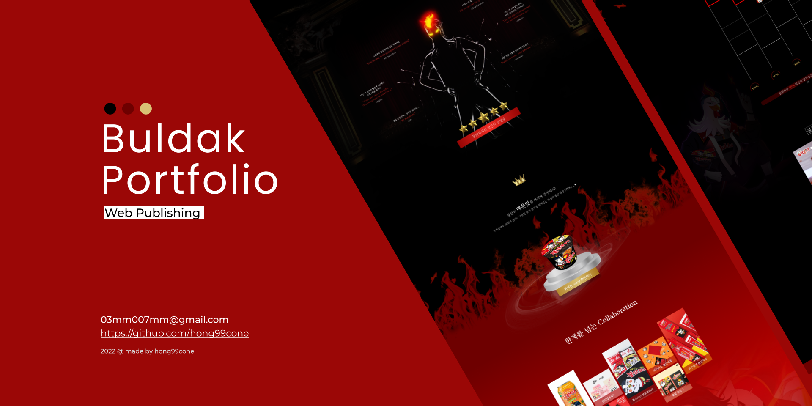

### Hello✌️ This is My Second Project! ✨ 
 

# 불닭볶음면 프로모션 :gem:

     
 

💡 기여도 : 기획 100%, 디자인100%, 퍼블리싱100%   
💡 사용툴 : Figma, Photoshop, Illustrator, Vscode   
💡 반응형 : PC형, Mobile형

 

   
       

 

**<a href="https://hong99cone.github.io/Buldak/" target="_blank">Website is here! </a>**

* * *
 

 

1. Description
2. Wireframe / Desgin

 

* * * 

## 📝 Description
- 뮤지컬 컨셉을 기반으로 불닭볶음면의 제품을 소개하는 원페이지
- 불닭볶음면의 연대기를 볼 수있는 타임라인, 불닭 레시피 등 과 같은 다양한 컨텐츠를 배치    
- 브랜드 메인색상인 블랙과 레드를 사용  

 
 
 

## 📝 Wireframe / UI Design
**Figma를 이용해 Wireframe과 UIdesign 시안 제작**

자세한 사항은 링크를 통해 확인하실수 있습니다.  
<a href="https://www.figma.com/file/7kNuqFdZn8NFU17BXjI2CF/?node-id=2%3A2" target="_blank">Wireframe / UI Design</a> 

 
 
